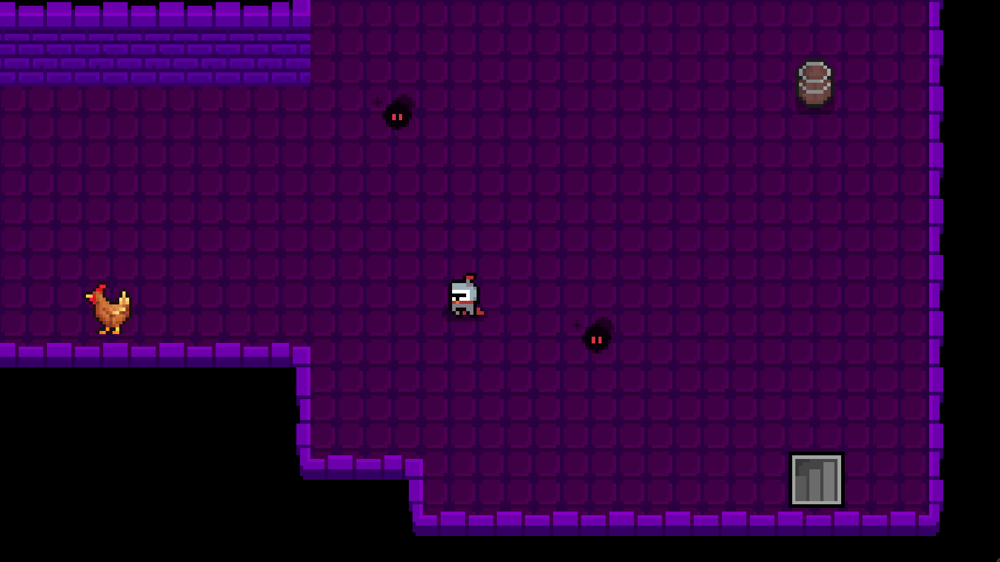
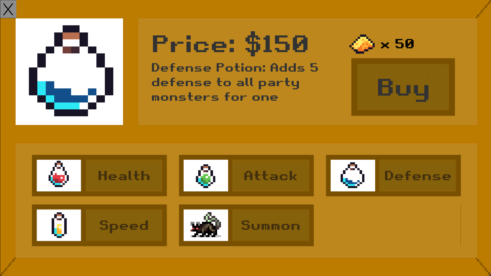
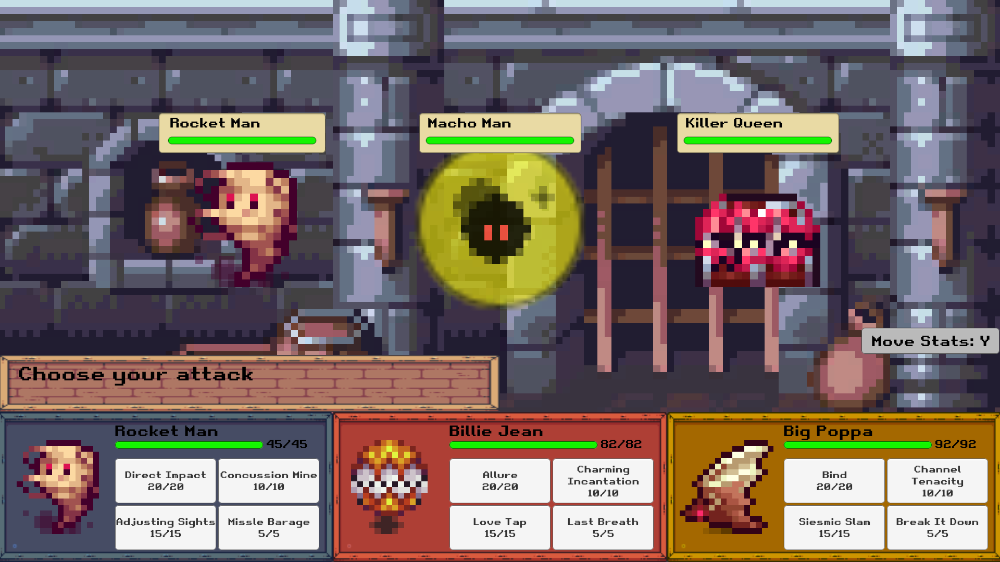

### Court of the Crimson King

# Introduction
Court of the Crimson King is a 2D rougelike with turn based combat and procedurally generated dungeons. The game was made during one semester of CAP4053 (taught by Tom Carbone) by Zach and his two teammates, Michael Ferrara and Pranav Sharma. The game pairs a typical dungeon crawling experience with an eccentric musical theming to create 
an unusal rougelike experience.

# Screenshots

A view from a procedurally generated dungeon, where the player can see enemies and a staircase.

A view from the shop, where the player can buy potions and even new monsters to fight their way through the dungeon.

A battle, where the player is in combat with the various monsters in the dungeon. Here is where the theme starts to shine!

# Links
The game was built with Unity, and is hosted on Github. A blog consisting of game updates and development history can be found at https://team11game.wordpress.com/blog-feed/, as well as the game's initial proposal.
